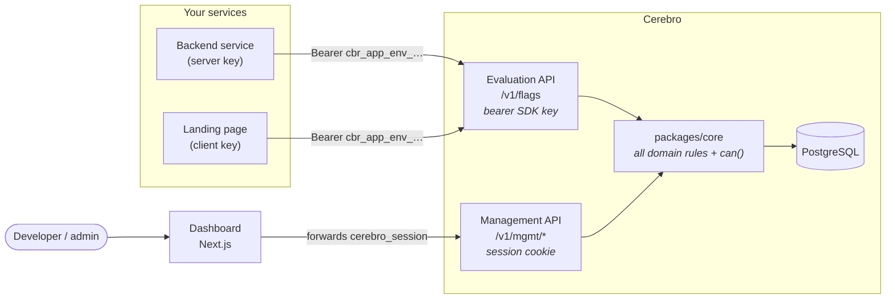
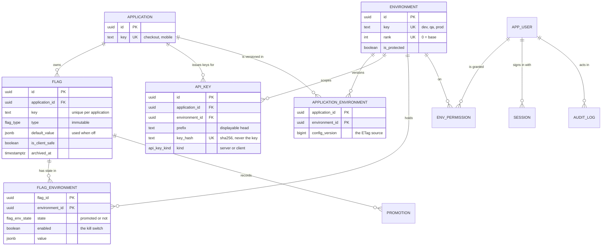
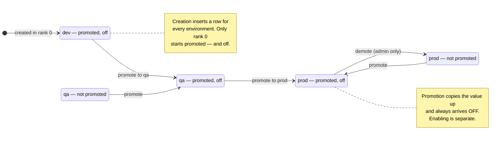
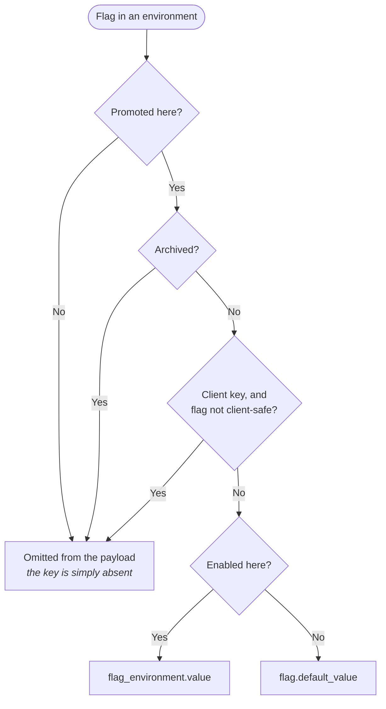
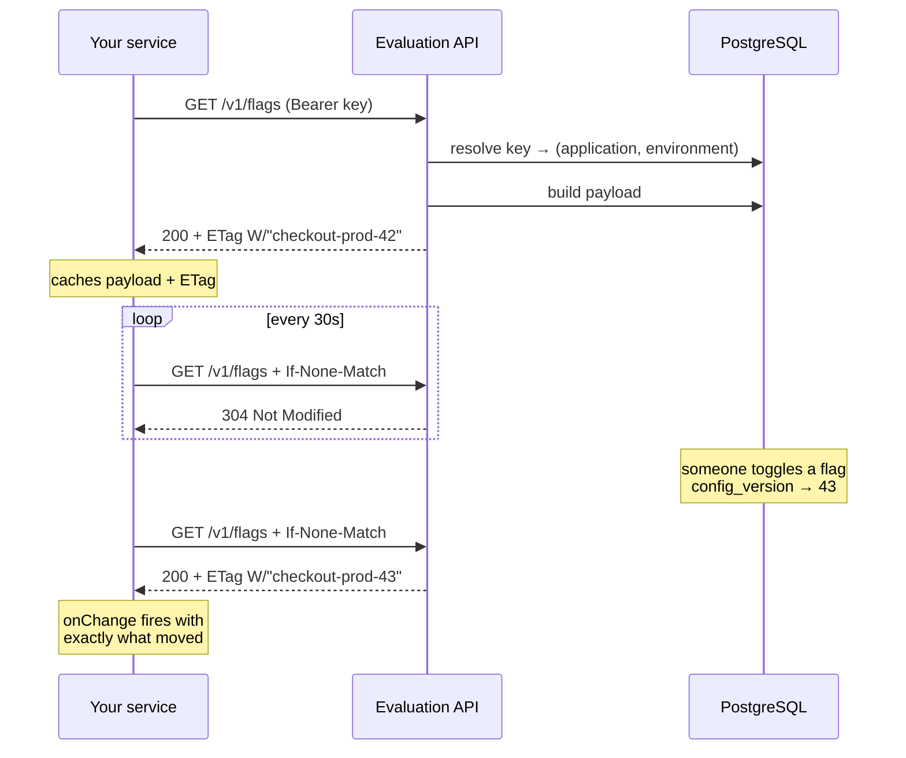

# Cerebro

A self-hosted feature flag service for a single organization.

Flags belong to an **application**. They are created in the lowest
**environment** and promoted upward through an ordered pipeline. Your services
read their own flags through one small HTTP endpoint; a dashboard and a
management API expose everything else.

```
checkout                     mobile
  new-checkout   boolean       new-checkout   string     ← unrelated flags
  max-cart-items number        banner-copy    string
```

Two applications may each hold a flag called `new-checkout`. They are different
flags with their own type, default value and per-environment state, and neither
application can see the other's.

---

## The two ideas everything else follows from

**1. A flag's definition is global to its application; its state is
per-environment.** The `flag` row holds identity, type and description exactly
once. A separate row per environment holds promotion state, on/off, and the
value. Promotion is therefore a *state transition on an existing row*, not a
copy — which is why the flag key means the same thing in every environment.

**2. `state` and `enabled` are independent axes.**

|  | Promotion (`state`) | Switching on (`enabled`) |
|---|---|---|
| Shape | Structural, sequential, permissioned | Instantaneous, reversible |
| Direction | Forward through the pipeline, one step at a time | Either way, any time |
| Meaning | *This flag exists here* | *This flag is live here* |

That separation is what makes a production rollback a toggle rather than a
deployment, and what lets a flag sit in production, switched off, for weeks
before launch.

---

## Concepts

| Term | What it is |
|---|---|
| **Application** | Owns a set of flags. Admin-created. Must exist before any flag can. |
| **Environment** | A stage in the pipeline — `dev`, `qa`, `prod`. Ranked; rank 0 is where flags are born. Shared by every application. |
| **Flag** | A typed value (`boolean`, `string`, `number`, `json`) belonging to one application. Its key is unique *within* that application. |
| **Promotion** | Making a flag available in the next environment up. Never switches it on. |
| **Enabled** | Whether consumers receive the environment's value or the flag's default. The kill switch. |
| **SDK key** | Resolves to one *(application, environment)* pair. `server` keys see everything promoted; `client` keys see only client-safe flags. |
| **Actor** | A person: `admin` (can do everything) or `developer` (needs explicit per-environment grants). |

---

## Architecture

Two independent APIs on one server. They share no middleware, so they can be
split into separate deployments later without touching a handler.



The dashboard never imports the domain layer or touches the database. It talks
to the management API over HTTP like any other client, so there is exactly one
authorization path in the system.

---

## Data model



Eleven tables in total; `session`, `promotion` and `audit_log` fill in the rest.
`packages/db/src/schema.ts` is authoritative.

Two details worth knowing:

- **`UNIQUE (application_id, key)` on `flag`** — not a globally unique key. This
  is what lets two teams both own `new-checkout`.
- **`config_version` lives on `(application, environment)`** — not on the
  environment. One team's release must not invalidate every other application's
  cached payload.

---

## The life of a flag



**Creating a flag** (one transaction) inserts the `flag` row, a
`flag_environment` row for *every* environment, marks only the rank-0 row as
promoted, records the initial promotion, bumps that environment's version, and
writes an audit row.

**Promotion is a prefix.** A flag is always promoted through an unbroken run
starting at rank 0 — you cannot skip. Five guards must pass:

1. The target is not the base environment (flags are born there)
2. The flag is not archived
3. The flag is promoted in **every** lower-ranked environment
4. The actor holds `promote` on the target (admins bypass)
5. It is not already promoted there

The value is copied from the highest promoted environment below the target, and
the flag **always arrives switched off**.

**Demotion** is admin-only and refused while the flag is promoted anywhere
higher up.

---

## How a value is resolved

This is the rule that decides what your application actually receives.



The consequence worth internalising: **every key present in the payload holds a
value of its declared type.** A consumer never handles `undefined` for a flag
that is actually promoted. A flag that isn't promoted is absent entirely — which
is why the SDK throws rather than returning `undefined`, unless you pass a
fallback.

Editing a value while a flag is off changes nothing that consumers can see. The
value is staged; enabling is what publishes it.

---

## The two APIs

### Evaluation — what your services call

```
GET /v1/flags            Authorization: Bearer cbr_<app>_<env>_…
GET /v1/config-version
```

**There is nothing to pass.** The application and environment both come from
the key — never a path, query parameter or header. To read a different pair,
use a different key.

That is deliberate: your code names no environment, so the same build runs in
dev, qa and prod with only the key changing. And a client key that ships to
browsers cannot be edited by whoever finds it to read production, or another
application's flags.

```json
{
  "new-checkout": true,
  "max-cart-items": 50,
  "banner-copy": "Summer sale",
  "pricing-rules": { "tier": "b", "discount": 0.1 }
}
```

`GET /v1/config-version` returns `{version, environment, application}` — the
quickest way to see what a key is bound to.

### Management — what the dashboard calls

Session cookie `cerebro_session`, obtained from `POST /v1/auth/login`. An SDK
key will never authenticate these routes.

| Group | Base |
|---|---|
| Auth | `/v1/auth/{login,logout,me}` |
| Applications | `/v1/mgmt/applications` |
| Flags | `/v1/mgmt/applications/{appKey}/flags/{key}` |
| Environments | `/v1/mgmt/environments` |
| API keys | `/v1/mgmt/api-keys` |
| People & permissions | `/v1/mgmt/users` |
| Audit | `/v1/mgmt/audit` |

Application, flag and environment **keys** are the public identifiers
everywhere. UUIDs never appear in URLs.

Full interactive reference at **`/docs`**, OpenAPI 3.1 at
**`/v1/openapi.json`** — both public, since you read them before you have
credentials.

---

## SDK keys

Format: `cbr_<appKey>_<envKey>_<32 url-safe chars>`. Only a SHA-256 hash is
stored; the raw key is shown exactly once, at creation, and is never
recoverable.

| Kind | Lives in | Receives |
|---|---|---|
| `server` | Your backend, CI, a container secret | Every promoted, non-archived flag |
| `client` | Shipped to browsers — **public by definition** | Only flags marked client-safe |

A client key ends up in a JavaScript bundle where anyone can read it, so it must
not be able to leak internal configuration. Mark a flag client-safe only if
you'd be happy seeing its value in view-source.

---

## Caching and freshness



`config_version` is a counter per *(application, environment)*, bumped inside
the same transaction as any write affecting that payload. The ETag is built from
it, so an unchanged payload costs a `304` and no work.

A change reaches consumers within one poll interval — no deploy, no restart. A
kill switch takes effect in seconds.

---

## Who can do what

Admins can do everything, everywhere, bypassing grants entirely. Developers
need an explicit grant per environment: `read`, `write`, `toggle` or `promote`.

| Action | Requires |
|---|---|
| Create / rename / delete an **application** | admin |
| Create, update, reorder, delete an **environment** | admin |
| Create or revoke an **API key** | admin |
| Manage **people and permissions** | admin |
| **Demote** a flag | admin |
| Create a flag, edit its metadata, archive, restore | `write` on the **rank-0** environment |
| Set a flag's **value** in environment E | `write` on E |
| **Toggle** a flag in E | `toggle` on E |
| **Promote** a flag into E | `promote` on E |
| **Read** a flag in E | `read` on E |
| Read the **audit log** | any signed-in user |

Applications partition *what exists*, not *who may touch it* — a developer with
`toggle` on prod can toggle any application's flags in prod.

Permissions are decided in exactly one place: `can(actor, action, environmentId)`
in `packages/core/src/rbac.ts`. Route handlers contain no permission logic
beyond calling it, and the API computes `canPromote` / `canToggle` / `canWrite`
per environment for the dashboard, which renders from those booleans rather than
re-deriving anything.

---

## Audit

Every mutation writes an audit row **inside the same transaction** as the change
itself, so the trail cannot drift from reality. Twenty-three actions are
recorded:

```
flag.created     flag.updated     flag.archived    flag.restored
flag.promoted    flag.demoted     flag.enabled     flag.disabled
flag.value_changed

application.created  application.updated  application.deleted
environment.created  environment.updated  environment.reordered
environment.deleted

api_key.created  api_key.revoked
user.created     user.updated     user.disabled
permission.granted  permission.revoked
```

Each row records who, what, which application, which environment, and the
before/after state.

---

## The dashboard

| Page | |
|---|---|
| `/` | Applications, or straight into the only one |
| `/apps/[appKey]` | The flag matrix — one row per flag, one column per environment |
| `/apps/[appKey]/flags/[key]` | Per-environment cards: typed value editor, toggle, promote |
| `/applications` | Create, rename, delete applications *(admin)* |
| `/environments` | Reorder the pipeline, protect, delete *(admin)* |
| `/keys` | Create and revoke SDK keys *(admin)* |
| `/team` | People, roles and the permission grid *(admin)* |
| `/audit` | Filterable log with before/after expansion |

The matrix draws each flag as a line running through the environments in rank
order. Solid track is how far the flag has reached; dotted is where it has not.
The join between them — the *frontier* — answers "how far has this shipped" as a
position rather than something to decode. A lit node means the flag is live
there. See [`design/direction.md`](../design/direction.md).

Writes to an environment marked **protected** require typing the flag key to
confirm.

---

## Running it

```bash
cp .env.example .env      # set SESSION_SECRET and SEED_ADMIN_PASSWORD
docker compose up -d      # PostgreSQL 16 on :5434
bun install
bun run db:migrate
bun run db:seed
bun run dev               # API on :3011, dashboard on :3000
```

The seed creates `admin@local`, `dev@local` (a developer with full rights on dev
and qa, read-only on prod), the three environments, and a `default` application
to put flags in.

```bash
bun test             # 126 tests across core, api and sdk, against a real Postgres
bun run typecheck
bun run lint
bun run db:generate  # after editing packages/db/src/schema.ts
```

Acceptance scripts, with the API running and the database seeded:

```bash
bash scripts/walkthrough.sh        # management API, developer → admin
bash scripts/evaluation-check.sh   # keys, payloads, ETag caching, isolation
bash scripts/codegen-check.sh      # generated types narrow get() per key
```

---

## Where the code lives

| Path | |
|---|---|
| `packages/db` | Drizzle schema, migrations, seed — the authoritative data model |
| `packages/core` | Every domain rule: rbac, applications, flags, promotion, payload, audit. Pure; takes a transaction handle, performs no HTTP, reads no environment variables |
| `packages/contracts` | Zod schemas and types shared by the API and the dashboard |
| `packages/client` | `@cerebro/client` — the published library and `cerebro-codegen`, with React and Next entry points |
| `apps/api` | Hono server — the two route trees |
| `apps/web` | Next.js dashboard |

Every domain mutation wraps a single `db.transaction` containing the write, the
audit row and the version bump. The API layer maps `DomainError.code` to an HTTP
status through a lookup table — handlers contain no business branching.

For setup details, the API surface and the deliberate deviations from the
original specification, see the [README](../README.md). The specification itself
is [`plan/foundation.md`](../plan/foundation.md).
